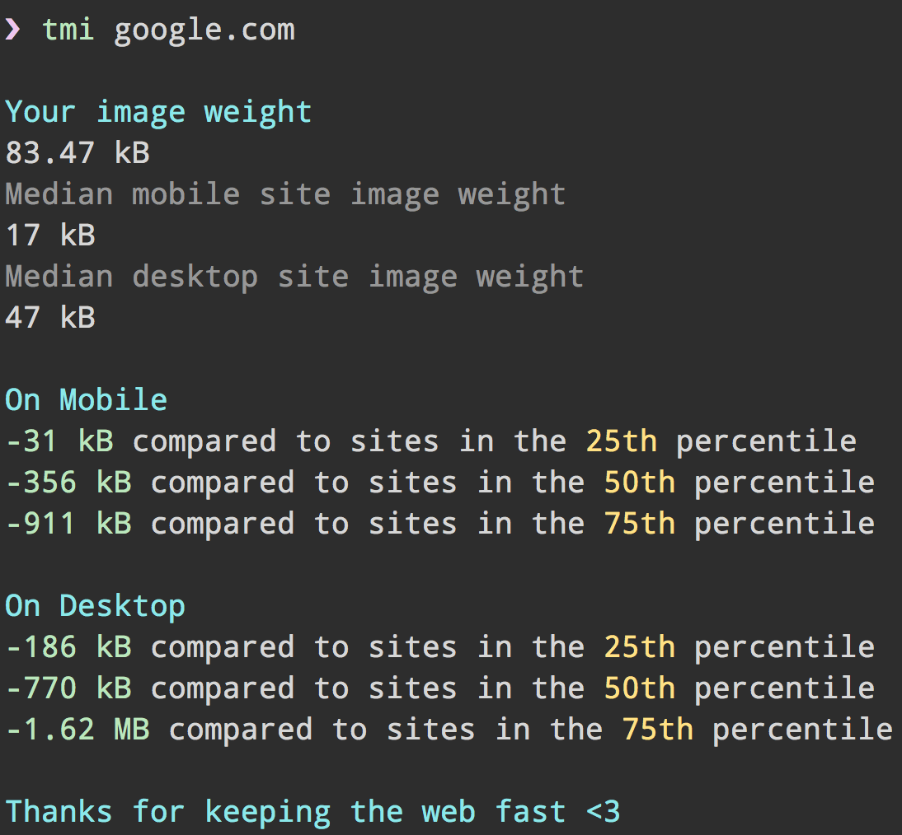
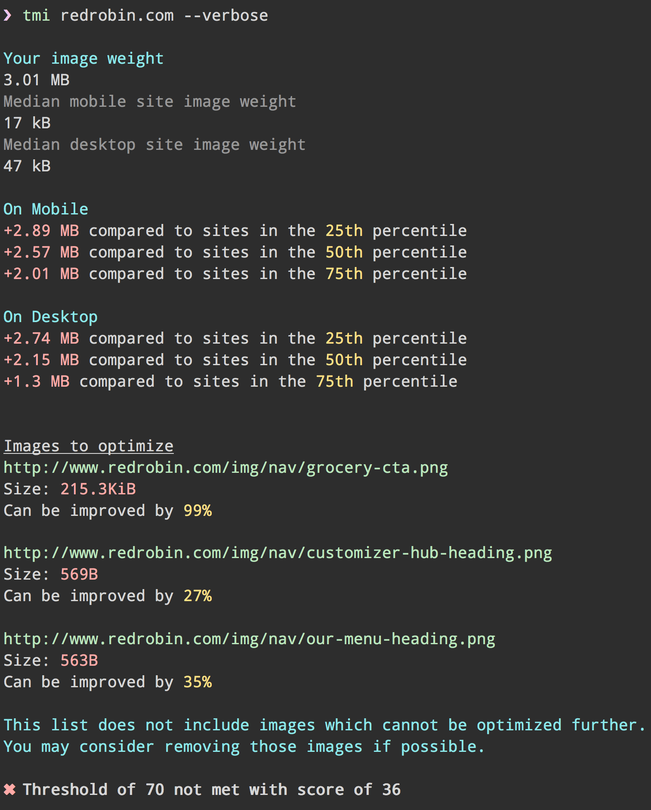

# tmi - too many images [](https://travis-ci.org/addyosmani/tmi)

> Discover your image weight on the web



Find out the image weight in your pages, compare to the BigQuery quantiles and discover what images you can optimize further.


## Install

```
$ npm install --global tmi
```


## Usage

```
$ tmi --help

  Usage
    $ tmi <url> [options]

  Options
    --verbose    Detailed summary
    --key        Google API Key. By default the free tier is used
    --strategy   Strategy to use when analyzing the page: mobile|desktop
    --locale     Locale results should be generated in
    --threshold  Threshold score to pass the PageSpeed test

  Example
    $ tmi todomvc.com --strategy=desktop
```


## Verbose mode

Verbose mode will show you a detailed summary of which images needs improving.




## Good test URLs

* [LG Watch](http://www.lg.com/us/smart-watches)
* [MySpace homepage](http://myspace.com)
* [Mercedes Benz](https://www.mercedes-benz.com/)
* [Apple iMac](http://www.apple.com/imac/)
* [Cyclemon](http://www.cyclemon.com/)


## Local testing

We plan on adding support for testing localhost and local files in the very near future. Until then, [ngrok](https://ngrok.com/) should be able to help get you mostly there.


## API

See [`psi`](https://github.com/addyosmani/psi) if you need a programmatic API for PageSpeed Insights.


## License

Apache-2.0
Copyright 2015 Google Inc
